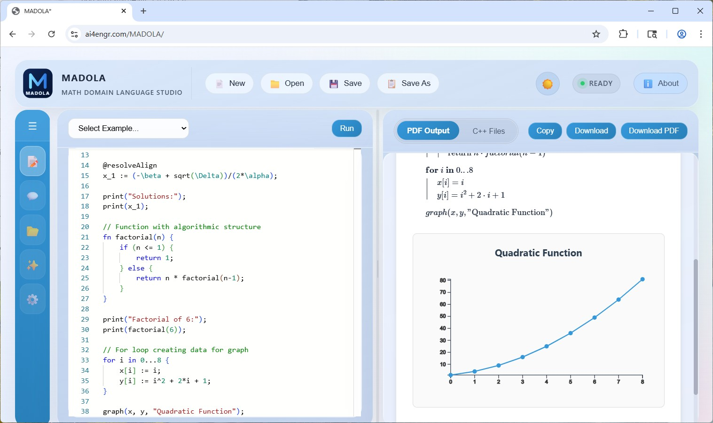

# MADOLA — Math Domain Language

**Math-Driven Coding with Automatic Documentation.**  

MADOLA integrates *mathematical notation, computation, documentation,* and *code generation* within a single file. It is not intended to replace existing languages or applications. MADOLA is still in its **early** stages and under active development.



👉 Try it here: [https://ai4engr.com/MADOLA/](https://ai4engr.com/MADOLA/)
---

## 🧭 Why Not Create a New Wheel?

Because existing tools each solve *only part* of the problem.

| Problem | Existing Tools | Limitation |
|----------|----------------|-------------|
| You want readable math *and* executable code | **LaTeX / Typst** | Static, non-executable |
| You want strong computation | **Python / Julia / MATLAB** | Requires libraries; syntax differs from standard math notation |
| You want visual documentation | **Mathcad / Mathematica / Maple** | Proprietary and closed |
| You want modern web deployment | **None of the above** | No native WASM or HTML flow |
| You want **AI** to help you | **None of the above** | No direct AI suport |

MADOLA exists because **no single tool unites mathematics, documentation, and computation** in an open, compiler-based environment.  
> It’s not another wheel — it’s the **hub** connecting them all.

---

## 💡 What is MADOLA?

### MADOLA stands for **MA**th **DO**main **LA**nguage.
It looks like math, runs like code, and publishes like LaTeX.

- 🧮 Mathematical syntax — write equations exactly as you would on paper
- 📝 Built-in documentation — generate HTML with LaTeX-style formatting and equations
- 🤖 AI-powered — let **AI** assist you with MADOLA code (under development)
- 🔄 Version control friendly — plain-text source works seamlessly with Git and other tools
- 📦 Import system — reuse functions or load external WASM modules
- 🧩 Rich language features — supports functions, matrices, complex numbers, and units
- ⚡ High performance — WASM execution can be **5–25×** faster than standard AST evaluation
- ⚙️ Code generation — compile directly to C++ or WebAssembly (WASM)
- 🌍 Cross-platform — works on Windows, Linux, and macOS
- 🧠 Tree-sitter integration — syntax highlighting and IDE support for VS Code, Vim, and Emacs


---

### ✍️ Literate Mathematical Programming
Although it is organized as source code, it is built on the belief that code should map directly to clear, expressive LaTeX-style mathematics. It naturally blends executable logic with human-readable documentation.

```madola
@h2{
Funciton to calculate π Using the Leibniz Series
}

@gen_cpp
fn calcPi(n) {
    sum := 0.0;
    for i in 0...n{
        sum := sum + ((-1)^i) / ((2*i)+1);
    }
    return sum * 4;
}
```

This single `.mda` file cane execute directly, generate HTML documentation with Latex eqaution and produce optimized **C++** or **WASM** modules  

<h2>
Funciton to calculate π Using the Leibniz Series
</h2>

$$
\begin{flalign}
\textbf{function } calcPi(n) \\
\left|
\begin{array}{l}
\quad sum =0 \\
\quad \textbf{for } i \textbf{ in } 0...n \\
\quad \left|
\begin{array}{l}
\quad sum =sum + \frac{{(-1)}^{i}}{\left(2 \cdot i + 1\right)} \\
\end{array}
\right. \\
\quad \text{return } sum \cdot 4
\end{array}
\right.
\end{flalign}
$$


```cpp
#include <cmath>

double calcPi(double n)
{
    double sum = 0;
    for (int i = 0; i <= n; i++) {
        sum = (sum + (pow(-1, i) / ((2 * i) + 1)));
    }
    return (sum * 4);
}
```

→ **One source = code, math, and explanation.**

---

### 🔬 Comparison with Other Systems

See detailed comparisons with [Mathcad, Python/Julia, Mathematica/Maple/MATLAB, and LaTeX/Typst](docs/COMPARISON.md).

---

### ⚙️ Code Generation & Extensibility

From a single `.mda` file, MADOLA can output:

- 🧠 Executable math programs  
- 🧾 HTML documentation  
- 💻 Optimized **C++** source  
- 🌐 **WASM** modules for browsers  

```madola
@gen_cpp
fn integrate(f, a, b, n) {
    h := (b - a) / n;
    return h * math.summation(f(i), i, 1, n);
}
```

---

### 🧠 Why It Matters

MADOLA bridges the gap between:
- Code and explanation  
- Notation and execution  
- Desktop and web  

It’s ideal for:
- **Research papers** with live math  
- **Engineering formulas** with computation  
- **Educational material** with examples  
- **Web apps** with real math logic  

---

## 🌟 Language Guide
See the [Language Guide](LANGUAGE_GUIDE.md) for syntax examples.

---

## 🌟 Documentation Generation

### Command-Line Usage

MADOLA provides a command-line interface for executing programs and generating documentation.

**Basic Syntax:**
```
madola <file.mda> [--html]
```

**Arguments:**
- `<file.mda>` - MADOLA source file to process (required)
- `--html` - Output HTML format with integrated graphs and math (optional)

### Examples

**Execute a MADOLA file:**
```cmd
# Windows
.\dist\madola.exe example.mda

# Linux/macOS
./dist/madola example.mda
```

**Generate HTML report:**
```cmd
# Output to stdout (can be redirected to file)
.\dist\madola.exe example.mda --html > output.html

# Using dev.bat wrapper (Windows)
.\dev.bat run example.mda --html > report.html

# Using dev.sh wrapper (Linux/macOS)
./dev.sh run example.mda --html > report.html
```

### HTML Output Features

When using the `--html` flag, MADOLA generates a complete HTML document with:

- **MathJax Integration** - Beautiful rendering of mathematical expressions
- **Execution Results** - Computed values displayed inline with code
- **Formatted Output** - Proper styling for headings, paragraphs, and tables
- **Graph Support** - Visual plots and charts (if included in your code)
- **LaTeX-Style Math** - Professional mathematical notation
- **Responsive Design** - Works on desktop and mobile browsers

The generated HTML file is self-contained and can be opened directly in any modern web browser.

---

## Development Guide
See the [Development Guide](Development.md) for syntax examples.

## License
MADOLA is distributed under the [Apache License](Apache_License.md). We reserve the right to adopt a dual-license scheme for commercial/business use in the future.


## Join or Support Us
You can help by donating or contributing to the project. We welcome **developers**, **testers**, and **support volunteers** — even a $10 donation makes a real difference. Sending us [**Claude Code**](https://www.claude.com/pricing) or [**Codex**](https://developers.openai.com/codex/pricing/) Credits would greatly help us. MADOLA is a non-profit initiative; any simply help sustain the project. With sufficient funding, we can create more full-time positions and speed up development.


## Premium Services

We also offer premium services to help your business integrate MADOLA effectively:
* **WYSIWYG** editor
* Assistance with self-hosted setup
* Cloud applications and storage
* Custom domain and WebAssembly (WASM) solutions
* Get help through phone support or in-person training

## Roadmap

We are currently working toward the 1.0 stable release. Our long-term goals include:

* AI-powered interactive coding environment
* WYSIWYG editor and interactive UI input
* Symbolic computation (integration, differentiation, etc.)
* Expanding into fields such as physics, chemistry, mechanics and many others
* 3D modeling support
* Integration with React and Vue components

### Current TODO List

1. [ ] **Higher-order functions** - Functions as first-class values
2. [ ] **GitHub Actions CI/CD** - Automated builds, tests, and releases
3. [ ] **Symbolic math** - Differential, integration, and equation solver support
4. [ ] **Image/SVG support** - Generate and manipulate images and SVG graphics
5. [ ] **File I/O** - Read and write CSV and text files
6. [ ] **WebGPU support** - GPU-accelerated computations and visualizations
7. [ ] **Document mode (WYSIWYG)** - Rich text editor alongside code mode

For the complete detailed roadmap, see [docs/TODO.md](docs/TODO.md).


## Pull Requests

* You can use **AI** tools to assist with coding.
* **Always review all changes carefully** before submitting a pull request.
* Keep pull requests **small and focused** to make review easier.


